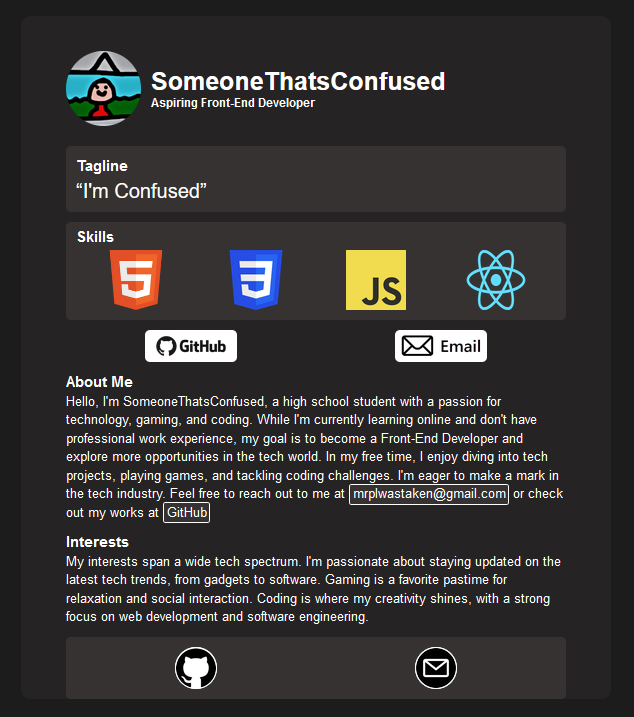
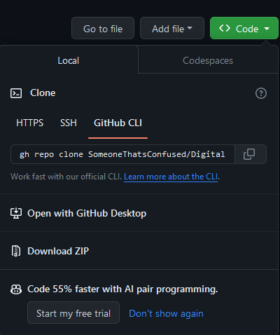
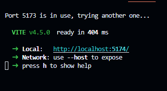

# Digital Business Card

This project is a part of the first solo project in the Scrimba React Course. It's a Digital Business Card created using Semantic HTML, CSS, and React JS.

## Table of Contents
- [Description](#description)
- [Project Requirements](#project-requirements)
- [Project Screenshot](#project-screenshot)
- [Getting Started](#getting-started)
  - [Clone it to your Machine](#clone-it-to-your-machine)
  - [Live Demo](#live-demo)
- [Usage](#usage)
- [Technologies Used](#technologies-used)

## Description

The Digital Business Card project is a web application built using React JS. It serves as a personal online business card with separate components for displaying personal information, a brief "About Me" section, showcasing interests, and including social icons in the footer.

## Project Requirements

- Build the project from scratch.
- Fill in your own information for personalization.
- Implement separate components for the following sections:
  - Info (photo, name, buttons, etc.)
  - About
  - Interests
  - Footer (social icons)

## Project Screenshot



## Getting Started

## Clone it to your Machine
1. Clone this repository to your local machine.
   


2. Open your terminal and navigate to the project's root directory.
```bash
cd [path/to/directory] // ignore the square brackets
```
3. Use the following command to install the project's dependencies:
```bash
npm i
```
4. Use the following command to start the development server:
```bash
npm run dev
```
5. The project will likely be available at [http://localhost:5173](http://localhost:5173).



## Live Demo

Visit this site to check it out live!

[Click me to visit the Site!](https://main--serene-melba-849c40.netlify.app/)

## Usage

This project is my solution to the Scrimba React course and can be used as a guide and source of inspiration for creating your own digital business card or similar web applications. You can study the code, components, and structure to gain insights into building similar projects.

## Technologies Used

- HTML
- CSS
- React JS
- Vite

Feel free to explore and study the project to making your very own Digital Business Card!
